<!-- Title -->
# OBS Retro Effects

    <i align="center">Bringing the Totally Rad 80s and 90s back to life.</i>

<h4 align="center">
    
    
    
    
     
    
    
</h4>

> **Note**
> While we only release new versions of Retro Effects after testing it on local hardware, there are bugs and issues that will slip through. If you happen to run into any issues, please [open an issue](https://github.com/finitesingularity/obs-retro-effects/issues) and we will work to resolve it.

## Introduction

Retro Effects is an OBS plug-in that provides several filters to simulate retro hardware (e.g.- CRTs, NTSC Signals, etc...) giving your OBS sources an authentic retro look/feel. Retro effects provides the following filters.

- [Chromatic Aberration](#chromatic-aberration)
- [Frame Skip](#frame-skip)
- [Interlace](#interlace)
- [Posterize](#posterize)
- [Dither](#dither)
- [CRT](#crt)
- [NTSC](#ntsc)
- [Cathode Boot](#cathode-boot)
- [Matrix Rain](#matrix-rain)
- [Retro Codec](#retro-codec)
- [VHS](#vhs)
- [Bloom](#bloom)
- [Scanlines](#scanlines)
- [Digital Glitch](#digital-glitch)
- [Analog Glitch](#analog-glitch)
- [Conclusion](#conclusion)

## Chromatic Aberration
This filter provides the abilility to shift the red, green, and blue color channels, either manually using the `Manual` type, or by simulating lens CA using the `Lens` type.

In Manual mode, each color channel can be individually shifted by a user specified distance and direction.

In Lens mode, color channels are shifted radially from the source's center by a user specified per-channel amount.

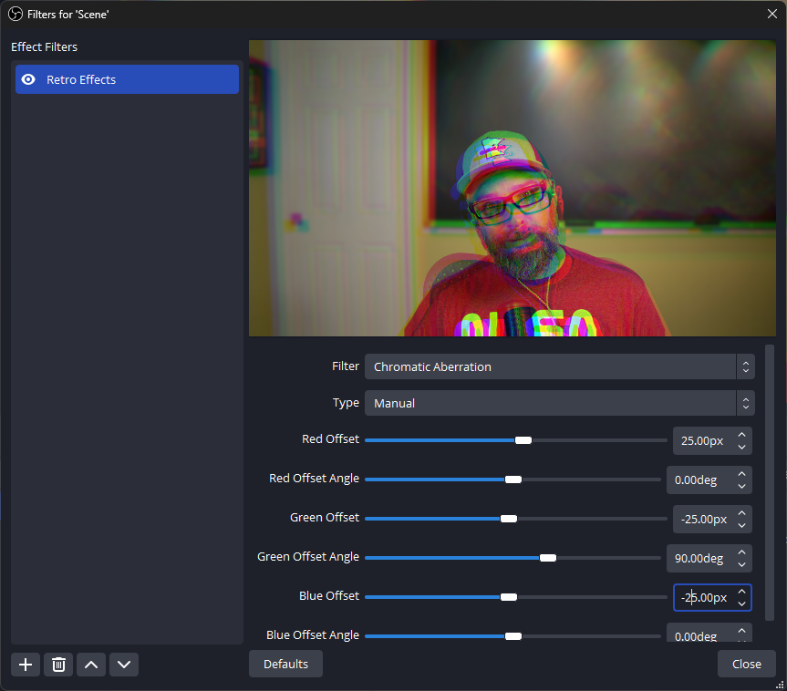

## Frame Skip
The frame skip filter allows the user to replicate skipped frames or lower framerates.  It provides a single slider to specify the number of frames skipped between frame renders.

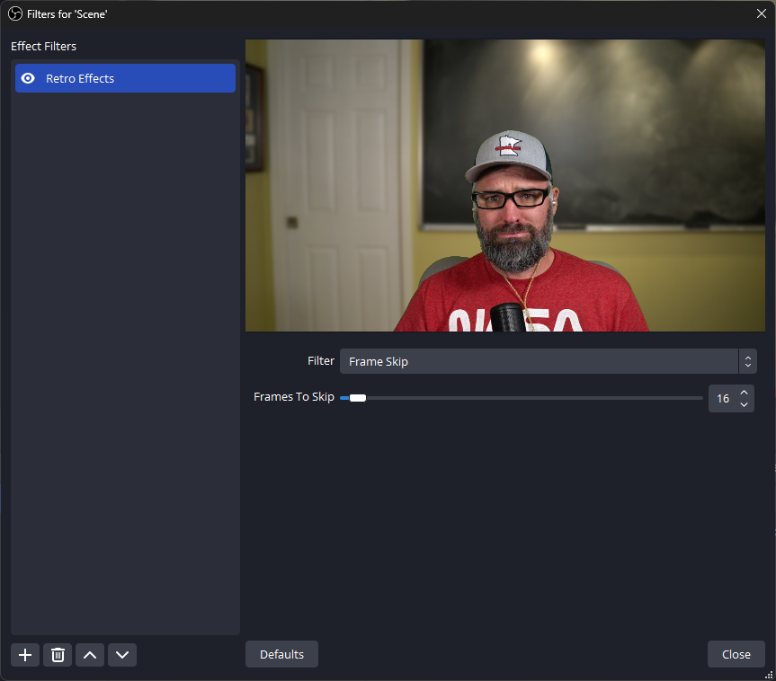

## Interlace
Interlacing is a technique where alternating lines of an image are displayed in two sequential fields, creating a complete frame that refreshes half of the lines at a time, commonly used in older television broadcasts.  This leads to characteristic combing artifacts that are seen when converting interlaced video to modern progressive scan displays.

The interlacing filter allows the user to specify the interlace line thickness, brightness reduction of the alternating field lines, and alpha reduction of the alternating field lines.

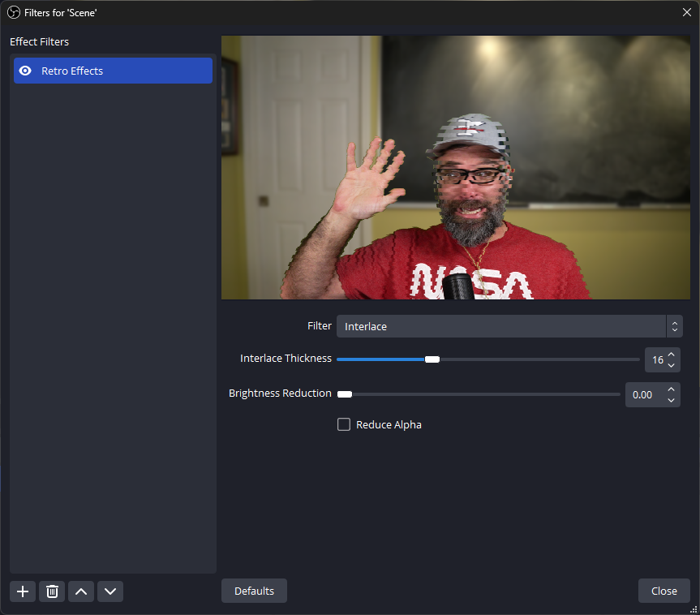

## Posterize
Posterizing is a process to reduce the number of colors in an image to create a simplified, graphic-like effect, often resembling a poster or comic book style.

Users have the ability to adjust the number of color levels used in the posterization process as well as options for how color palette sampling is handled.  Options for sampling include the original image colors, a user specified 2-color gradient, or the horizontal center line of any OBS source or scene.

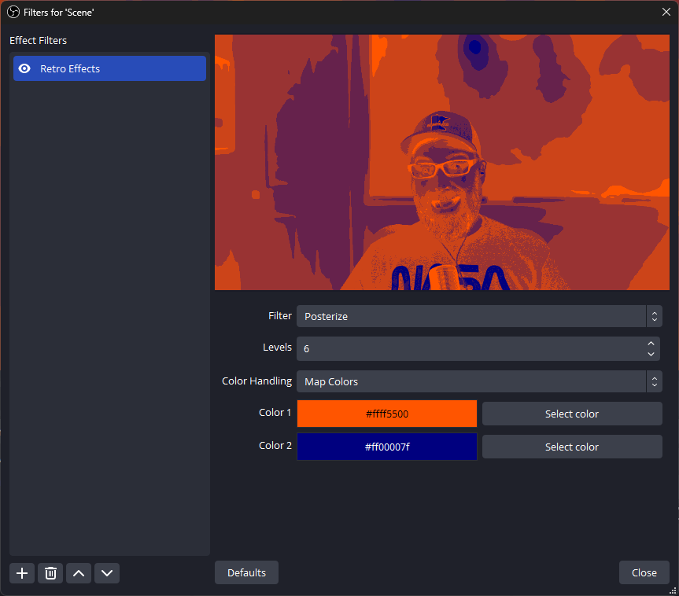

## Dither
Send your video back to Windows 3.1 with the dithering filter.  Dithering is a technique used on lower bit-depth displays to smooth transitions between different colors or shades by adding noise or patterns, thereby reducing the appearance of banding or color stepping.

The dithering filter provides the user with both ordered and unordered dithering algorithms that emulate graphics from early windows and mac computers. Options include the ordered dithering pattern used, dither size, colors per channel, monochromatic or color dithering, pixel resampling/rounding, and pre-dither contrast and gamma adjustments.

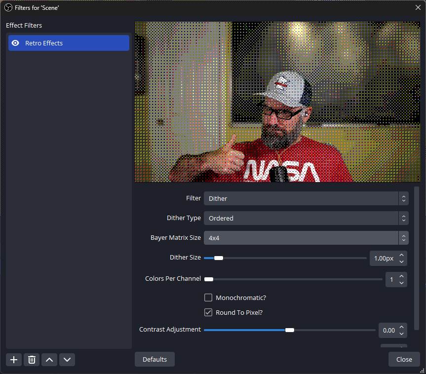

## CRT
The CRT Filter simulates various effects/artifacts as seen on older Cathode Ray Tube displays. Taste the static.

This filter provides 24 different phosphor mask layouts, and the ability to change the mask intensity. Also provides phosphor bloom with adjustable bloom size and threshold, CRT Geometry including corner radius, barrel distortion, and vignetting, and black and white level color correction.

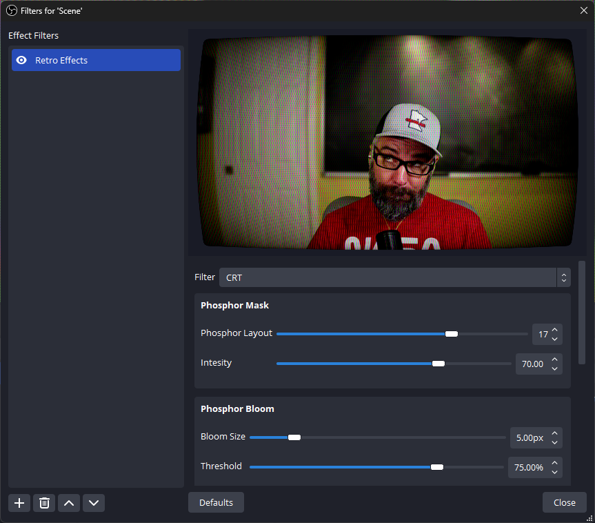

## NTSC
NTSC is a video broadcast standard used in North America and parts of South America and Asia, defining how color and monochrome video signals are transmitted and displayed on analog televisions. NTSC comes with its fair share of issues, leading to some calling it "Never The Same Color."

The NTSC filter simulates encoding and decoding a source introducing adjustable artifacts commonly experienced on older analog TVs.  User adjustable parameters include:

- Tuning Offset: simulates errors in tuning in an NTSC signal
- Luma noise: adds static noise to the NTSC luma signal
- Luma banding: adjustable size, strength and luma band/ring count.
- Chroma bleed size, steps and strength
- Brightness and saturation adjustment performed in the same way as done on an analog TV.
 
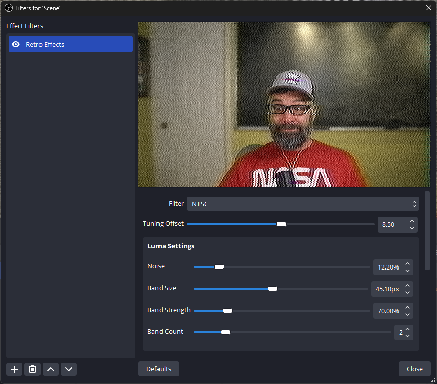

## Cathode Boot
When turning a CRT on and off, a characteristic vertical and horizontal collapse effect is commonly seen.

The CRT Boot filter provides the user with a progress slider (animatable with the move value plugin) that simulates CRT horizontal and vertical collapse.  The user can adjust geometry through the horizontal thickness, vertical thickness, and glow parameters.  Additionally the horizontal and vertical collapse as well as final fadout timing can be modified.

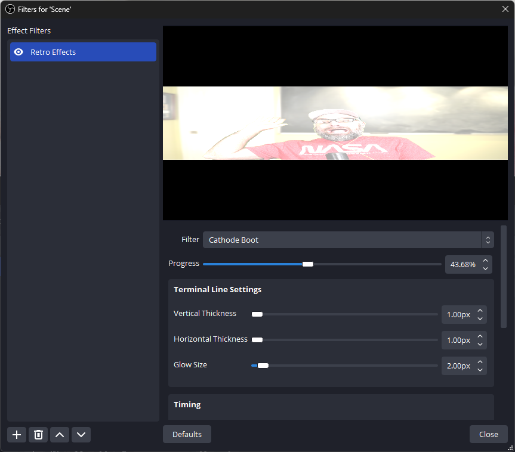

## Matrix Rain
You are now in The Matrix! The matrix rain filter uses the luminosity of a source, and animates the Matrix asthetic as seen in the iconic movie franchise of the same name.

It might not teach the user Kung-Fu but it will definitely make them say "Woahh!" by giving plenty of options to make the perfect rain effect, including:

- Several built-in character/font sets, and the ability to generate your own.
- Character scaling
- Noise shift to horizontally shift the rain
- Option to use source colors for the rain particles, or a user specified font and background color
- Black- and White-level adjustment to increase/decrease contrast.
- Minimum fade value for rain trails
- Active rain character brightness
- Rain Trail fade distance
- Rain drop speed
- Charcater bloom radius, threshold, and intensity.
- If you've read this far, you realize it is not just a movie file running in the background.

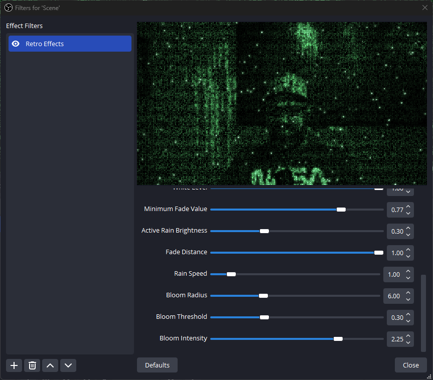

## Retro Codec
Video conference like its 1995 and you've got a sweet new Connectix QuickCam!  The Retro Codec filter simulates RPZA video codec in all its blocky, noisy, dithered glory.

User adjustable parameters include pixel scale, colors per channel, quality, keyframe interval, and custom thresholds.

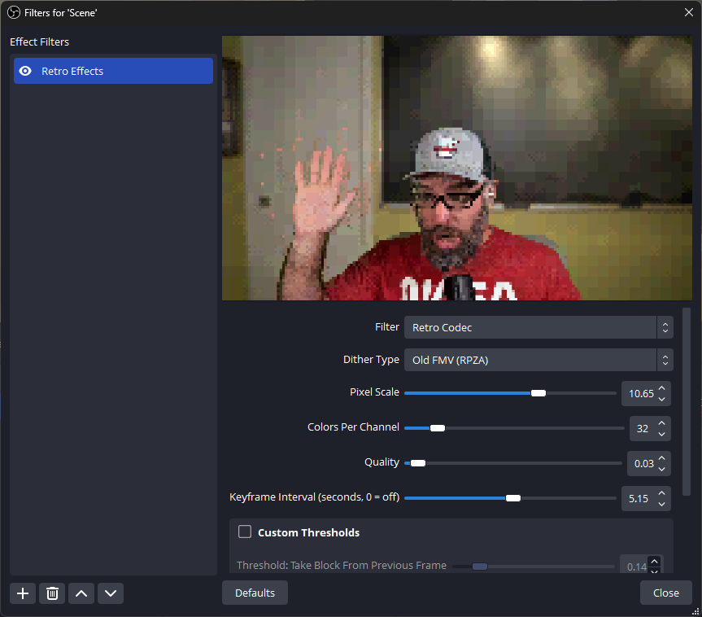

## VHS
Be kind, please rewind. The VHS filter emulates many artifacts seen when playing VHS tapes including tape wrinkle, frame jitter, pop lines, and head switching noise.  It gives the user many tweakable options:
- Frame Jitter: min/max size, min/max period, min/max random interval.
- Tape Wrinkle: Ocurrence probability, wrinkle size, duration.
- Pop Lines: amount
- Head Swithing Noise: Primary noise thickness, amount, Secondary noise thickness, horizontal offset, and amount.

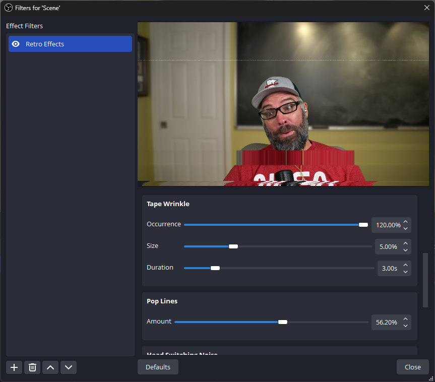

## Bloom
When is too bright not bright enough? When you want the bloom! The bloom filter will blow out those pesky highlights to give that Glam Cam feel to any OBS source.

Glamourous adjustments include bloom intensity, size, and threshold, a application to luminance, individual color channels, or a custom mix of channels.

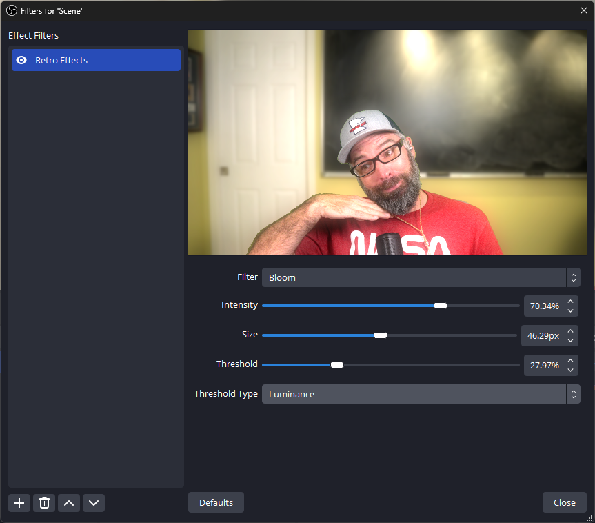

## Scanlines
Bring your video back to the terminal displays of old with the scanline filter. Adds animated scanlines to your source, with more adjustable parameters than a DEC VT101 Terminal:

- Scanline profile types including sine wave, square, sawtooth, smoothstep, or triangular.
- Scanline period
- Speed
- Intensity

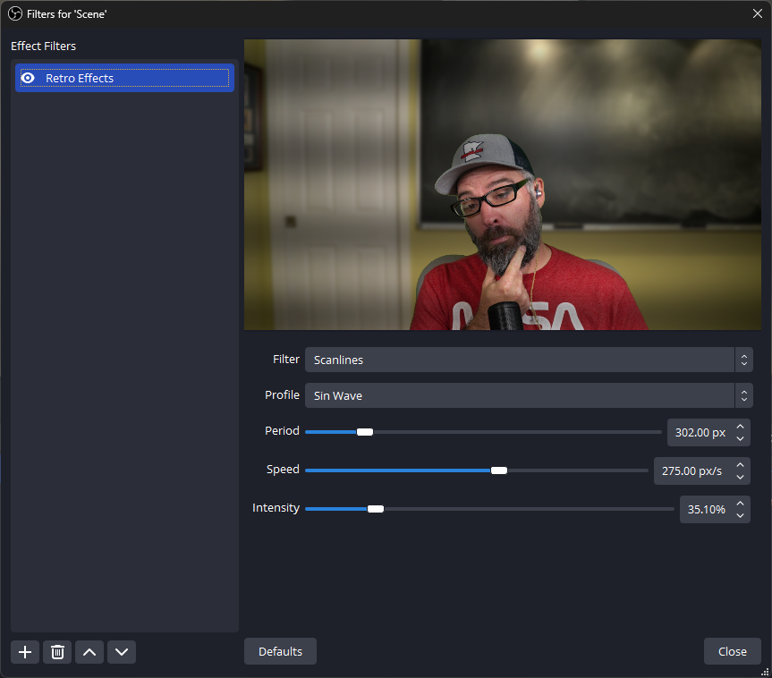

## Digital Glitch
D-d-d-d-digital glitch. Channel your innner Max Headroom and experience the glitchiness of the digital world.  The digital glitch filter emulates artifacts seen in corrupted video formats, including random block displacement and color drift.

User changable fields include:
- Block Geometry: maximum displacement, width and height range, interval range.
- Color Drift: maximum drift distance, height range, interval range.

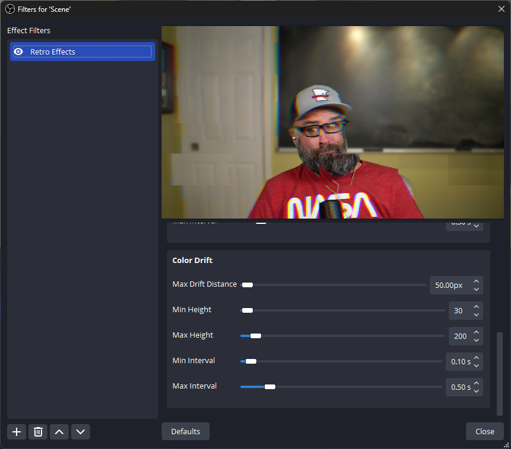

## Analog Glitch
This broadcast has been interrupted by analog glitch! Unlike the block digital glitch effect, analog glitch shifts and adds noise to your source in a smooth/contiunous way, much like noisy broadcasts back in the days of analog.

Adjust to your hearts content:
- Maximum random displacement
- Primary Wave speed, scale, and threshold
- Secondary Wave speed, scale, threshold, and influence
- Interference magnitude, line magnitude, and interference alpha
- Color drift maximum distance
- Desaturation Amount

## Conclusion
Grab the retro effects plugin today (as seen on TV) and party like its 1999.